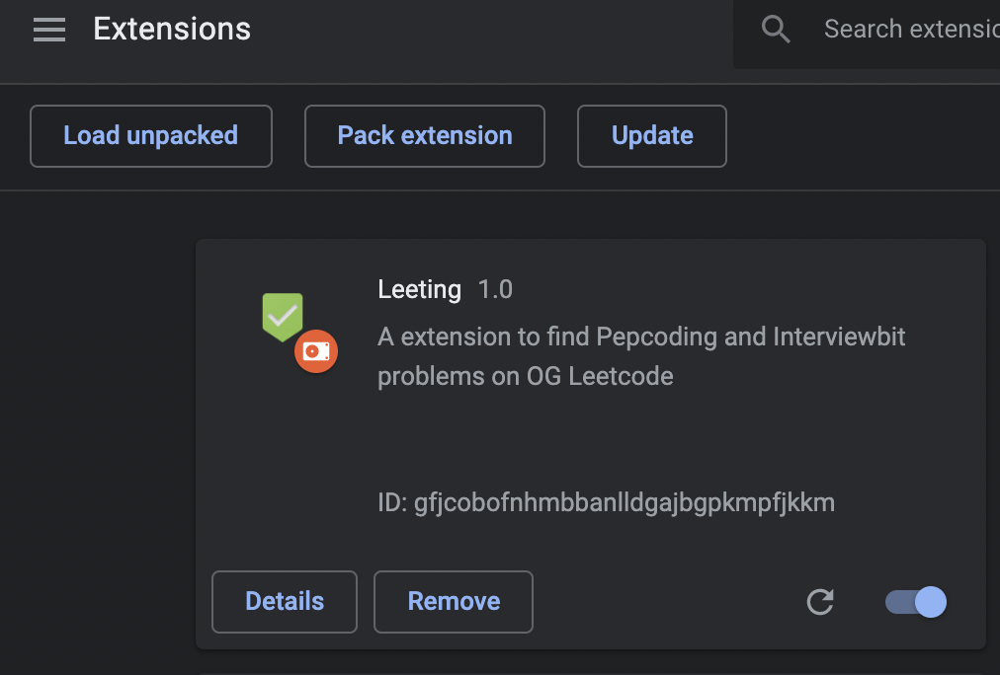
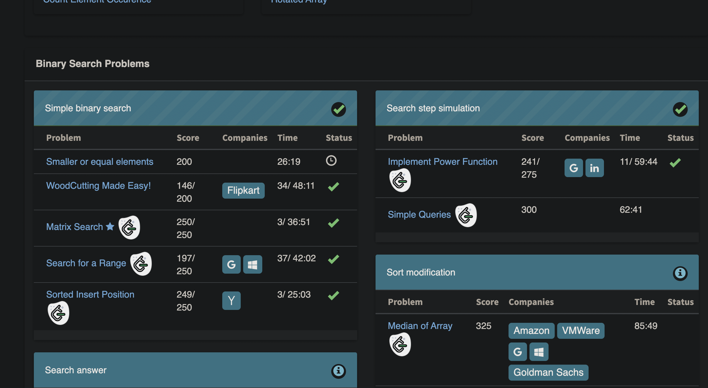

# Leeting

A extension to find Pepcoding and Interviewbit problems on OG Leetcode

##

## How to install

1] Open the Extension Management page by navigating to `chrome://extensions.`

2] Alternatively, open this page by clicking on the Extensions menu button and selecting Manage Extensions at the bottom of the menu.
Alternatively, open this page by clicking on the Chrome menu, hovering over More Tools then selecting Extensions

3] Enable Developer Mode by clicking the toggle switch next to Developer mode.
Click the Load unpacked button and select the extension directory.

## Features

- Direct links to leetcode problems
- Live links

## Screenshots

## Contributing

Contributions are always welcome!

Please adhere to this project's `code of conduct`.

## Authors

- [@spielers](https://github.com/spielers)
